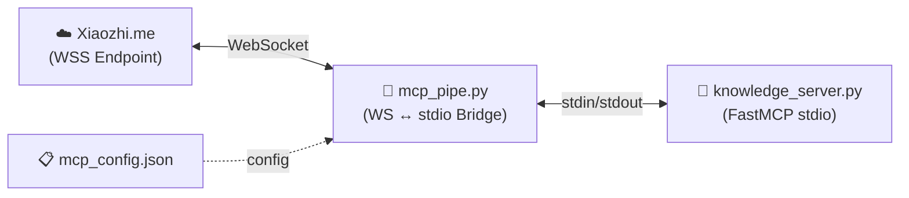

# DHsystem MCP Knowledge Hub - Backend

Máy chủ Knowledge Base cho thiết bị **ESP32-S3** chạy firmware **Xiaozhi AI** và các MCP Client khác.

## Kiến Trúc (Mới)

Kiến trúc đã loại bỏ hoàn toàn Supabase và chuyển sang sử dụng Appwrite (metadata) cục bộ cùng ChromaDB (vector store). Hỗ trợ chuẩn kết nối MCP mới nhất qua stdio pipe.



## Cài Đặt

### 1. Cài Python packages

```bash
cd backend
pip install -r requirements.txt
```

### 2. Cấu hình môi trường

```bash
# Copy template
cp .env.example .env

# Điền thông tin vào .env:
# APPWRITE_PROJECT_ID=xxx
# APPWRITE_API_KEY=xxx
# GEMINI_API_KEY=AIza...
# MCP_ENDPOINT=wss://your-xiaozhi-wss-url-here
```

### 3. Kiểm tra cấu hình

Tự động khởi tạo Database/Collection trên Appwrite nếu chưa có:

```bash
python setup_check.py
```

---

## 🚀 Kết Nối với xiaozhi.me (Quan Trọng)

Để thiết bị ESP32-S3 sử dụng được kho kiến thức của bạn khi kết nối với máy chủ trung tâm Xiaozhi.me, bạn phải chạy file `mcp_pipe.py`.

### Bước 1: Lấy URL WebSocket từ xiaozhi.me
1. Đăng nhập vào Console [xiaozhi.me](https://xiaozhi.me)
2. Chọn thiết bị của bạn 
3. Vào phần Thiết lập MCP (MCP Server)
4. Console sẽ cấp cho bạn một endpoint dạng WSS, ví dụ: `wss://api.xiaozhi.me/v1/mcp/...`
5. Copy đường dẫn này.

### Bước 2: Cấu hình
Dán URL vào file `backend/.env`:
```
MCP_ENDPOINT=wss://api.xiaozhi.me/v1/mcp/xxx
```

### Bước 3: Chạy MCP Pipe (Cầu nối)
```bash
cd backend
python mcp_pipe.py
```
Hệ thống sẽ:
1. Đọc file `mcp_config.json`
2. Khởi chạy `knowledge_server.py`
3. Push tool `search_knowledge_base` lên đám mây Xiaozhi
4. Sẵn sàng nhận lệnh từ ESP32-S3

---

## Các File Quan Trọng

- `knowledge_server.py` : Máy chủ FastMCP chứa logic RAG (Retrieval-Augmented Generation).
- `mcp_pipe.py` : Script bridge kết nối `knowledge_server.py` (chạy chuẩn stdio) sang WebSocket của Xiaozhi.
- `mcp_config.json` : Tệp quy định danh sách các server sẽ được pipe up.
- `server.py` : Web server API cho Frontend (React) tải lên file, nạp dữ liệu.
- `ingest.py` : Script cắt dữ liệu (Chunking) & nhúng vector (Embedding) đẩy vào ChromaDB.

---

## MCP Tools Hiện Có

| Tool | Mô tả | Input |
|---|---|---|
| `search_knowledge_base` | Tìm kiếm ngữ nghĩa trong KB bằng Vector | `query`, `kb_id?`, `top_k?` |
| `list_knowledge_bases` | Liệt kê tất cả KB | _(không cần)_ |
| `get_knowledge_base_info` | Chi tiết về một KB | `kb_id` |

